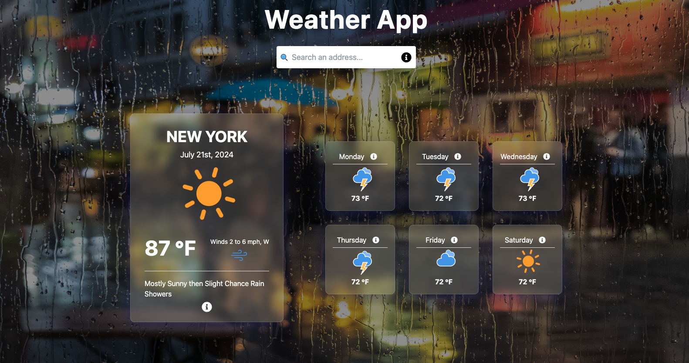
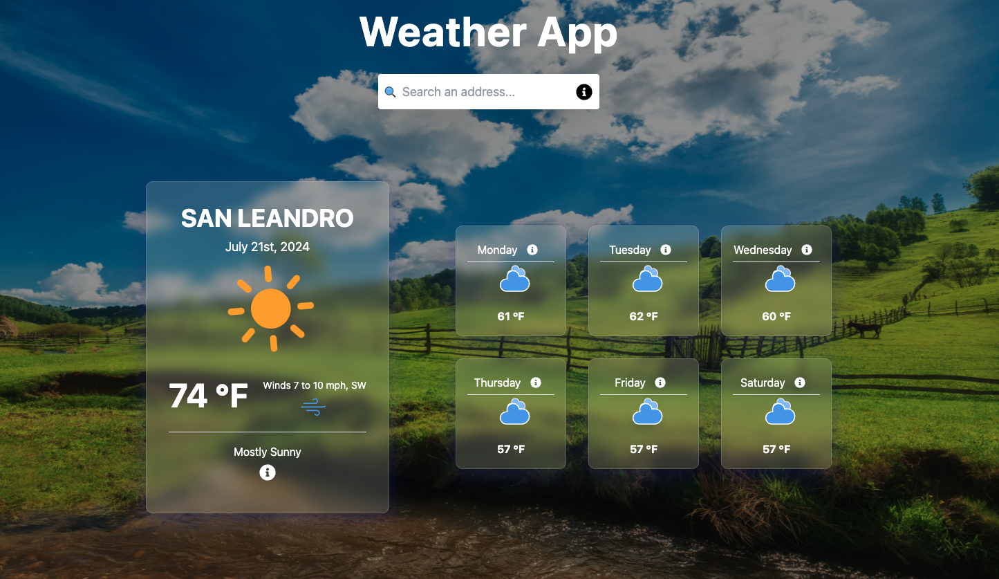
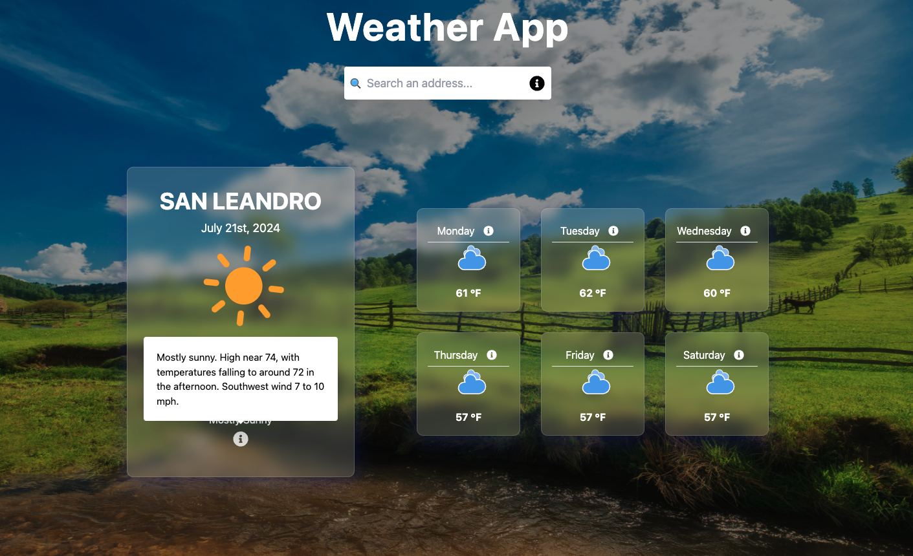
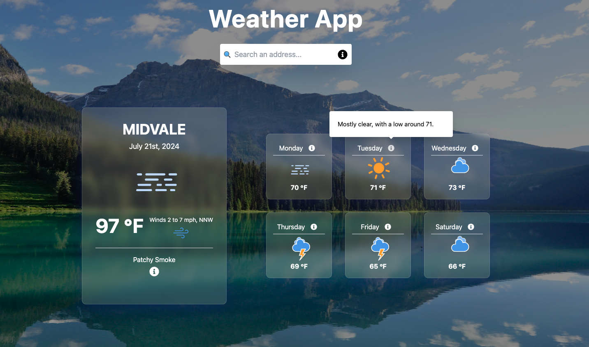

<div align="center" style="margin-bottom: 20px;">
  <h1>
    WEATHER FORECAST APP
  </h1>

  <div align="center">
    
    
    
    
  </div>
</div>

## :memo: About project

The project is a weather forecast application that consumes the US Census geocode API to obtain geolocation and the US government weather API (weather.gov). Essentially, the user can enter an address in a single line in the search field and receive the weather forecast for the next 7 days. The project was developed using React.js, TypeScript, and TailwindCSS.

## :rocket: Technologies

- [Vite](https://vitejs.dev/)
- [React](https://react.dev/)
- [TypeScript](https://www.typescriptlang.org/)
- [Tailwind CSS](https://tailwindcss.com/)
- [Radix UI](https://www.radix-ui.com/)
- [Axios](https://axios-http.com/docs/intro)
- [React Icons](https://react-icons.github.io/react-icons/)
- [Toastify](https://fkhadra.github.io/react-toastify/introduction/)

## :cyclone: Run this project

```bash
# Clone this project
$ git clone git@github.com:jefferson1104/weather-app.git

# Project directory
$ cd weather-app

# Install dependencies
$ npm install

# run the project as development mode
$ npm run dev

# open in your browser
http://localhost:5174
```

## 🎨 Screenshots

<div>
    
    
    
    
</div>

## Some addresses to test

- 697 Broad St, Newark
- 3144 47th street, Astoria
- 1275 Marina Blvd, San Leandro
- 25620 The Old Rd Suite P, Stevenson Ranch
- 1132 East Fort Union Blvd, Midvale
- 3736 W Center Park Dr Suite 120, West Jordan
